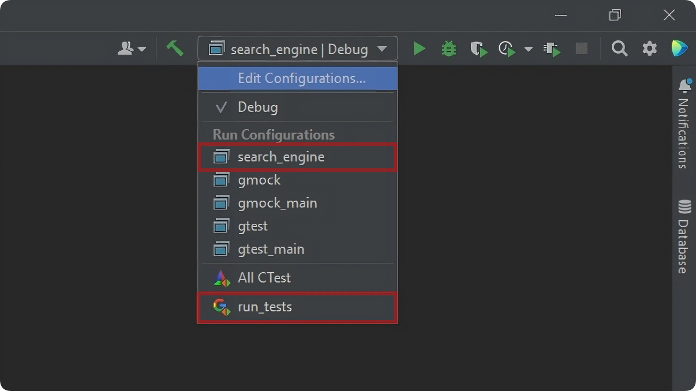

# Corporate Portal Search Engine
## Used Technologies & Software
- External library: [***JSON for Modern C++***](https://github.com/nlohmann/json "Visit library github")
- Testing framework: [***GoogleTest***](https://github.com/google "Visit framework github")
- Built-in C++ tools for multithreading
- CMake
- CLion 2022.2
## Project Properies & Structure
Program is used to show the files that are more appropriate to users' requests via relevance calculation.

The project structure is Object Oriented, so it consists of three header files with classes' interfaces, which are implemented in .cpp files, classes:
- ***ConverterJSON*** for manipulating with .json files via the aforementioned library
- ***InvertedIndex*** for restructuring documents for faster search
- ***SearchServer*** for searching process.

Then we have ***test.cpp*** written with *GoogleTest* framefork for testing the program.

All the files among which the search is taking place are placed in the folder *resources*, which in turn is in the folder *cmake-build-debug*. In the second folder also three .json files are located:
- ***config.json*** has the info about maximum responses for one request, name of the engine and its' version and paths to the files among which the search will be conducted
- ***requests.json*** stores requests, there user writes requests
- ***answers.json*** outputs a response to each request

Search engine looks for files that have ***all*** request words considering their case, additionally the engine perceives words with punctuation marks as one word.

Search engine for running needs:
- files in ***resource*** folder, various data files
- correctly written config.json and requests.json

In addition project has downloaded and unpacked ***JSON for Modern C++*** library, so you don't need to mess with setting it up and don't worry if the new version of the library will be compatible with the project.

## Installation
Current instruction is about installation and running the program in CLion IDE.
1. [***Download ZIP Archive***](https://github.com/kuksarnlav/search_engine/archive/refs/heads/main.zip "Download search engine") of the project
2. Unpack the archive into your folder destination
3. Open project folder via CLion
4. Click OK in configuration dialog window
5. Move the filling of the ***cmake-build-debug-filling*** folder to ***cmake-build-debug*** folder
6. Wait project to build
7. When project is built run the ***search_engine*** configuration to run the program
8. To run tests run the ***run_tests*** configuration

Project already has some resource and .json files that are filled in correctly and are representative enough.